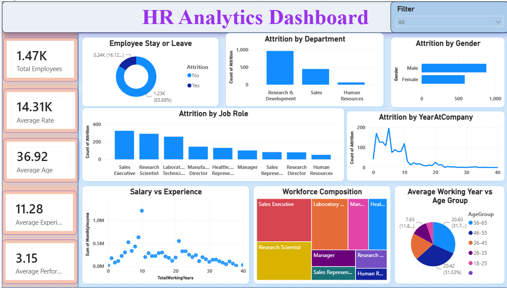

# 📊 HR Analytics Dashboard

<p align="center">
  
</p>

<p align="center">
  
  
  
  
  
  
</p>

---

## 📖 Project Overview

The **HR Analytics Dashboard** project analyzes employee data to identify key factors influencing employee attrition and retention. Using **Python** for data preprocessing and **Power BI** for visualization, the project provides actionable insights that help HR teams make informed decisions and improve workforce management.

---

## 🎯 Project Objectives

- 📌 Analyze employee attrition trends
- 🏢 Compare attrition across departments
- 👨‍💼 Compare attrition across job roles
- 💰 Study salary and experience patterns
- 📈 Build HR KPIs
- 📊 Create an interactive Power BI dashboard
- 💡 Generate business insights for decision-making

---

## 🛠️ Tools & Technologies

| Tool | Purpose |
|------|---------|
| 🐍 Python | Data Cleaning & Analysis |
| 🐼 Pandas | Data Manipulation |
| 🔢 NumPy | Numerical Computation |
| 📉 Matplotlib | Data Visualization |
| 🎨 Seaborn | Statistical Visualization |
| 📊 Power BI | Interactive Dashboard |
| 💻 GitHub | Version Control & Portfolio |

---

## 📂 Project Structure

```
HR-Analytics-Dashboard
│
├── HR_Analytics.ipynb
├── HR_Analytics_Dashboard.pbix
├── WA_Fn-UseC_-HR-Employee-Attrition.csv
├── HR_Analytics_Cleaned.csv
├── HR_Analytics_Report.pdf
├── README.md
│
├── Images
│   ├── Dashboard.png
│   ├── KPIs.png
│   ├── Correlation_Heatmap.png
│   ├── Department_Analysis.png
│   ├── JobRole_Analysis.png
│   └── Salary_Analysis.png
```

---

## 📈 Dashboard KPIs

✔️ Total Employees

✔️ Employees Left

✔️ Attrition Rate

✔️ Retention Rate

✔️ Active Employees

✔️ Average Monthly Income

✔️ Average Age

✔️ Average Years at Company

---

## 📊 Dashboard Visualizations

- 🍩 Attrition Distribution
- 📊 Department-wise Attrition
- 👨‍💼 Job Role Analysis
- 🚻 Gender-wise Attrition
- 📈 Salary vs Experience
- 🔥 Correlation Heatmap
- 🌳 Department & Job Role Treemap
- 🎛️ Interactive Slicers

---

## 🔍 Key Insights

- 📌 Sales department experienced the highest attrition.
- ⏰ Employees working overtime were more likely to leave.
- 💰 Lower monthly income showed higher attrition.
- 📉 Employees with fewer years at the company had greater turnover.
- 😊 Higher job satisfaction was associated with better retention.
- 🏢 Attrition varied significantly across job roles and departments.

---

## 💡 Business Recommendations

- Improve employee work-life balance.
- Review compensation for lower-income employees.
- Introduce employee recognition and engagement programs.
- Conduct regular employee satisfaction surveys.
- Offer career growth and learning opportunities.
- Focus on retaining employees during their initial years.

---

## 🖼️ Dashboard Preview

> Replace the image below with your actual dashboard screenshot.

<p align="center">
  
</p>

---

## 🚀 Future Scope

- Implement Machine Learning models to predict employee attrition.
- Integrate real-time HR data.
- Develop automated HR reporting dashboards.
- Perform sentiment analysis using employee feedback.

---

## 👨‍💻 Author

**Harshit Bhalwal**

- 🎓 Data Analytics Enthusiast
- 📊 Power BI | Python | SQL
- 🌱 Passionate about Data Analytics & Business Intelligence

---

## ⭐ Support

If you found this project helpful, consider giving it a **⭐ Star** on GitHub!
